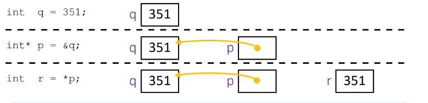

### Examining Data Representations
Code to print byte representation of data
- Treat any data type as a byte array by casting its address to 
char*
- has unchecked casts
```c
void show_bytes(char* start, int len) {
  int i;
  for (i = 0; i < len; i++)
    printf("%p\t0x%.2hhX\n", start+i, *(start+i));
  printf("\n");
}

void show_int(int x) {
show_bytes((char*) &x, sizeof(int)); // we cast byte array as char*
}

int x = 123456; // 0x00 01 E2 40
printf("int x = %d;\n", x);
show_int(x);    // show_bytes((char *) &x, sizeof(int));

int x = 123456;   
0x7fffb245549c  0x40
0x7fffb245549d  0xE2
0x7fffb245549e  0x01
0x7fffb245549f  0x00
```

printf legend:
- Special characters:\t = Tab, \n = newline
- Format specifiers: %p = pointer, 
  - %.2hhX = 1 byte (hh) in hex (X), padding to 2 digits (.2)
### Array in C
- Declaration: int a[6] (type name[num(element)])
  - indexing: &a[i] is the address of a[0] + i times of the element size in byte
    - int*p;,p = a; | p[1] is equivalent to *(p+1) as we get 1 + 4 byte away column element from the pointer of a[0] row from both syntax
- note: C has no bound checking, whcih could result in dirty write


### Assignment in C
- A variable is represented by a location
- Declaration != initialization (initially holds random data)
- int x, y;
  - let x is at address 0x04 (03 | 27 | D0 |3C) and y is at 0x18 (00 | 27 | D0 | 3C)

- left-hand side = right-hand side;
  - lhs must evaluate to a location
  - rhs must evaluate to a value (this could be an address)
  - store rhs `value` to lhs `location`
- x = 0;
- y = 0x3CD02700 (little endian)
- x = y +3;
  - get value at y, add 3, store in x
- int* z = &y + 3
  - get address of y 'add three', store in z
  - z = 0x18 + 3(4)_{dec} = $1 \cdot 16^1 + 8\cdot16^0 + 12 = 36 \to 2 \cdot 16^1 + 4 \cdot 16^0 = 0x24$

- *z = y 
  - this also get a pointer z of location (0x24) and store the value of y

### Addresses and Pointers in C
- & = 'address of' operator
- * = 'value at address' or 'dereference' operator
### In-Lecture Poll
what woulld a[0], a[1] and p  be after the execution?
```c
void main() {
  int a[] = {0x5,0x10}; 
  int* p = a; // p points to the array address; array address pointer need not &; 0x100
  p = p + 1; // move p to next element
  *p = *p + 1; // a{1} + 1
}
```
- a[0] = 0x5, a[1] = 0x11, p = 0x104
  - int increment by n*4 byte

which of the {x+10, p +10, &x + 10, *(&p), ar[1], &ar[2]} evaluate to an address? 

and

How much space does the varaible p take up?

```c
int x = 351;
char* p = &x;
int ar[3];
```
- p + 10, &x + 10, &ar[2], *(&p)
  - note: derefering an pointer (&p) to p give us &x
- p takes up 8 bytes (irelvenat to the delcared type), but instead depedn on the bit system (64 vs 32)

---


### C Strings
- C does not explicity support string data type
    - they are actyakkt arrats if characters that are termianted by the null character (ex.'hi' -> 'h'| 'i' |'\0'), the \0, which evaluate to 0 and used in the context of *char and **char
```c
#include <stdio.h>

int main() {
   // dec 89 -> char Y, dec 111 -> char o, dec 33 -> !
  char str[] = {89, 111, 33, 0, 121, 111, 117};
  // notice that it stops at ^ despite there being more data afterwards
  printf("%s\n", str);
}
//output: Yo!
```
Question to think about: How many bytes of memory are allocated for the string literal "CSE 351"?
- 6 + 2, becuase there are 6 divisible chracters with 1 space and the null terminator
### Arrays
- def: sets of contiguous locations in memory that store the same type of data object
    - to declare: `type array_name[num]; `
    - the subscript notation: `array_name[n]`, which is actually access by *(array_name +n)
        - recall: how pointer points to the first element (i:0), where led us still have n element still need to be dereferecned to access the n-th array
        - note: C does not check any bound, so there could be logical erros or bad memory access by default

ex. how many bytes are in long my_array[5]; ? 40

ex. let char_array[0]  starts at the address 0x350, what would the address of char_Array[-2] be?

- $0x350 - (2 \cdot 1) = = 3 \cdot 16^2 +5 \cdot 16^1 + 0 - (2 \cdot 1) = 848 - 2$ in decimal =  0x34E in hex
- note: char takes up 1 byte (sizeof(char) = 1)

### Pointer Arithmetic
 For `int *p1, *p2`(type*x, *y), `p1+1`  will evaluate to the stored address incremented by 1 (int = 4 bytes or long = 8 bytes) and p2-p1 will return the number (the distance) of ints/long between the two addresses

```c
int* p1;
int* p2;
p1 = 0x0;
p2 = p1 + 3;  // p1 increments by 3(4bytes), which results a 12 bytes

//output (address in p2): 0xC
```

```c
int* p1;
int* p2;
p1 = 0x0;
p2 = p1 + 3;
printf("%d\n", p2 - p1);  // numerical (not byte) difference in number of int elements

//output: 3
```


### Box-and Arrow diagram



### Pointers in C
- pointers are special varaibles of word size that store addresses
```c
type* ptr; // note: type encodes the 'size' information, which is to accompany with the 'location' of your value ptr
```

- the address-of operator (&) goes in front of a varaible and returns the address of that variable in memory, which is to be storeed in a pointer of an appropriate type*
```
#include <stdio.h> // this copies the output to an .h executable to prototype function 
int main() {
  int q;
  int* p = &q;  // &q help us get the address of q stored as an int* with a pointer of 'p'
  printf("p = %p\n", p); // printf('p = address/pointer_formater(param)\n', param = p)
}

//output: p = 0x7ffc80fa0074
```
- The dereference operator (*) is used to access the data that a pointer points to  by specified

```c
#include <stdio.h>
int main() {
  int q = 351;
  int* p = &q;
  int r = *p;  // store the data pointed at by p (dereferenced/accessed) in r
  printf("p = %p\n", p);
  printf("r = %d\n", r);
}

// output:
//p = 0x7ffe4b197614
//r = 351

```
- NULL, a symbolic constnat. It evaluates to zero and indicate a pointer pointer to nothing (needs to be intilaized to a pointer). Dereferencing NULL can results in a runtime error

```c
#include <stdio.h>

int main() {
  int* ptr;
  int x = 5;
  int y = 2;
  ptr = &x;
  y = 1 + *ptr;
  printf("y = %d\n", y);
}
//output: 6
```
but if we change x to NULL
```c
#include <stdio.h>

int main() {
  int* ptr = NULL;
  int y = 2;
  y = 1 + *ptr; //runtime error

  printf("y = %d\n", y); 
  return 0;
}
```
