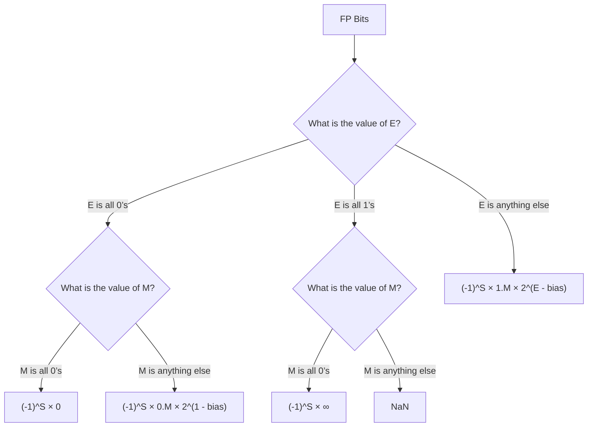

## Lecture Slides
### Floating Point Summary
- Floats also suffer from the fixed number of bits
available to represent them
    - Can get overflow/underflow
    - “Gaps” produced in representable numbers means we can
lose precision, unlike ints
        - Some “simple fractions” have no exact representation (e.g. 0.2)
        - “Every operation gets a slightly wrong result”
- Floating point arithmetic not associative or
distributive
- Mathematically equivalent ways of writing an expression
may compute different results
- Never test floating point values for equality! (==)
- Careful when converting between ints and floats!

### Floating Point Representation Summary  
S: 1 bit, E: 8 bits, M: 32 bits
Handles large numbers, small numbers, special numbers
- Exponent in biased notation (bias = 2w-1–1)
    - Size of exponent field determines our representable range
    - Outside of representable exponents is overflow and underflow
- Mantissa approximates fractional portion of binary point
    - Size of mantissa field determines our representable precision
    - Implicit leading 1 (normalized) except in special cases
    - Exceeding length causes rounding
### Number Representation Matters
- 1991: Patriot missile targeting error
    - clock skew due to conversion from integer to floating point
- 1996: Ariane 5 rocket exploded ($1 billion)
    - overflow converting 64-bit floating point to 16-bit integer
- 2000: Y2K problem
    - limited (decimal) representation: overflow, wrap-around
- 2038: Unix epoch rollover
    - Unix epoch = seconds since 12am, January 1, 1970
    - signed 32-bit integer representation rolls over to TMin in 2038
- Other related bugs:
    - 1982: Vancouver Stock Exchange 10% error in less than 2 years
    - 1994: Intel Pentium FDIV (floating point division) HW bug ($475 million)
    - 1997: USS Yorktown “smart” warship stranded: divide by zero
    - 1998: Mars Climate Orbiter crashed: unit mismatch ($193 million)
### Floating Point Conversions in C
- Casting between int, float, and double changes the bit representation
    - tries to preserve the original value, but not always reversible
- int or float → double
    - Exact conversion (all 32-bit ints representable)
- int → float
    - Large values may be rounded (not enough bits in mantissa)
    - Overflow impossible
- long → double
    - Depends on word size (32-bit longs are exact, 64-bit may be
rounded)
- double or float → int
    - Truncates fractional part (rounded toward zero)
    - “Not defined” when out of range or NaN: generally sets to TMin (even if the value is a very big positive)

### Floating Point in C
Two common data types, with two levels of precision:
- float 1.0f single precision (32-bit)
- double 1.0 double precision (64 bit)

#include <math.h> to get INFINITY and NAN constants

#include <float.h> for additional constants

- Equality (==) comparisons between floating point numbers are treacky, and often return unexpected result, so avoid them
    - instead, use abs(f1 - f2) < threshold

### Mathematical Properties of FP Operations
- Overflow yields pm infinity and underflow yields 0
- Floats with values pm infinity and NaN can be used in operations

FP operations do not work like real math, due to rounding
- Not associative: (3.14+1e100)-1e100 != 3.14+(1e100-1e100)
- Not distributive: 100&(0.1 + 0.2) != 100*0.1 + 100*0.2
- Not cumulative: repeatedly adding a very small number to a large one may do nothing
### Floating Point Operation: Basic Idea
- x +_f y = Round(x + y)
- x*_f  y = Round(x* y)
Basic Idea for floating point operations:
- compute the exact result first
- then round the result ot it fit into specified precision (width of M)
    - still possible over/underflow if exponent is outside of range

### Distribution of Values
- What ranges are NOT representable?
    - Between largest norm and infinity Overflow (Exp too large)
    - Between zero and smallest denorm Underflow (Exp too small)
    -  Between norm or denorm numbers? Rounding
### Floating Point Interpretation Flow Chart
This helps you with checkpoint of representation

### Special Cases and their handling by FP Encoding

| **E**   | **M**        | **Meaning**      |
|---------|--------------|------------------|
| 0x00    | 0            | ±0               |
| 0x00    | non-zero     | ???              |
| 0x01–0xFE | anything   | ± norm num       |
| 0xFF    | 0            | ±∞               |
| 0xFF    | non-zero     | NaN              |

### Need Greater Precision (double precision: 2 x 32 bits)
- C variable declared as double
- Exponent bias is now $2^{11 - 1} -1 = 1023$
Advantage: greater precision (larger mantissa), greater range (larger exponent)

Disadvantage: more bits used, slower to manipulate

In 64 bit system
- S takes up 1 bit, E takes up 11 bit, and M takes 52 bits

### The Mantissa (Fraction) Field (Review)
- Note the implicit 1 in front of the M bit vector
    - give us an extra bit of precision
- Mantissa limits
    - Values near-but-above 2^{exp} have M = 0b...0
    - Values near-but-below 2^{exp + 1} have M = 0b1...1

### Precision and Accuracy
Precision is a count of the number of bits in a computer word
used to represent a value
- Capacity for accuracy
Accuracy is a measure of the difference between the actual
- value of a number and its computer representation

High precision permits high accuracy but does'nt guarantee it. It is possible to have high precision but low accuracy
- Example: float pi = 3.14;
    - pi will be represented using all 23 bits of the mantissa (highly precise), but is only an approximation(not accurate)

In 32 bit system
- S takes 1 bit, E takes 8 bits , and M takes 23 bits

### Limits of Representation 
- Limitations:
    - Even given an arbitrary number of bits, can only **exactly** represent numbers of the form x* 2^{y}
        - note:y can be negative
    - Other rational numbers have repeating bit representations

### Fractional Binary Numbers
Representation of rational number
- Bits to right of "binary point" represent fractional powers of 2
- $\sum^{i}_{k = -j} b_k \cdot 2^{k}$

Value: 5 and 3/4, Representation: 101.11_2 
- $1\cdot 2^{2} + 0 + 1 \cdot 2^{0} + 1 \cdot 2^{-1} + 1 \cdot 2^{-2} = 4 + 0 + 1 + 0.5 +  0.25 = 5.75$

Observations
- shift left = multiply by power of 2
- shift right = multiply by power of 2

### Representation of Fractions
- Binary Point, like decimal point, signifies boundary between integer and fractional parts:
    - example 6-bit representation: XX.YYYY, $2^1, 2^0; 2^{-1}, 2^{-2}, 2^{-3}, 2^{-4}$
    - example: $10.1010_2 =  1 \cdot 2^{1} + 0 + 1 \cdot 2^{-1} + 1 \cdot 2^{-3} = 2.625_{10}$

### Poll

## Pre-Lecture Reading
### RD 6.5 (to be filled)
### Normalized Floating Point Conversion
Procedure
IEEE FP $\to$ Decimal

1. Append the bits of `M` to the implicit leading `1`, forming the mantissa value.  
2. Multiply the mantissa by `2^(E - bias)`.  
3. Apply the sign: `(-1)^S`.  
4. Multiply out the exponent by shifting the binary point.  
5. Convert from binary to decimal.  

**Example**: `0xc0a80000` = `0b11000000101010000000000000000000` → Split as:  
- Sign (`S`): `1`  
- Exponent (`E`): `10000001` (binary) = `129` (decimal)  
- Mantissa (`M`): `01010000000000000000000`  

Steps:  
1. Mantissa = `1.01010000000000000000000` (implicit leading `1` + `M`).  
2. Exponent = `129 - 127 = 2` → Multiply by `2^2`: `1.0101... * 2^2`.  
3. Sign = `(-1)^1 = -1`.  
4. Shift binary point: `-101.01`.  
5. Convert to decimal: `-(4 + 1 + 0.25) = -5.25`.  

Decimal $\to$ IEEE FP

1. Convert decimal to binary.  
2. Normalize to scientific notation (`1.xxxxx_2 * 2^exponent`).  
3. Encode sign: `S = 0` (positive) or `S = 1` (negative).  
4. Encode exponent: `E = exponent + 127` (bias for single-precision).  
5. Encode mantissa: Truncate/pad `M` to 23 bits after the leading `1`.  

**Example**: `17.5`  
1. Binary: `17.5` = `10001.1_2`.  
2. Normalized: `1.00011_2 * 2^4`.  
3. Positive → `S = 0`.  
4. Exponent: `4 + 127 = 131` → `10000011_2`.  
5. Mantissa: `00011000000000000000000` (23 bits after leading `1`).  
Result: `0 10000011 00011000000000000000000` → Hex: `0x418C0000`.  

### IEEE 754 Floating Point (FP) Encoding Pt2
Mantissa Field:
- form: `1.bbbb_2`, where b is in {0,1}, 1.M
    - assumption: implicit leading one
    -  If the mantissa (without any trailing 0’s) is longer than the width of the mantissa field, then it is impossible to represent the exact value, leading to rounding errors
Example: Conversion in float, where the width of M is 23 bits
- Encode: a mantissa of $1.10111_2$, which renders a M = 0b 1011100 0000 0000 0000 0000 
- Decode : a M of 0b 110 1000 0000 0000 0000 0000 should render us a $1.1101_2$
- Encoding with rounding: 0.2 is encoded with infinite binary of $0.\bar{0011}_2$, which can be normalized to $1.\bar{1001}_2 \cdot 2^3$
    - note: $0.0011 = 0 + 0 + 2^{-3} + 2^{-4} = 0.1865$

Question: For the binary number 11.01_2, what will the encoded M field be?
- given the normalized binary number to be $1.101_2 \cdot 2^1$, we get 0b 101 to be begin with and fill out the rest of the 23 bits
    - 0B 101 0000 0000 0000 0000 0000

Question: given the float `0b 0100 0000 0111 0000 0000 0000 0000 0000`, what is the value's mantissa?
- Ans: given the lagging values of 1 is repeated three times behind the leading 1, we have a 1.111_2 instead of a 0.111_2
### IEEE 754 Floating Point (FP) Encoding Pt1
- Field translation: -1^{s} x 1.M x 2^{E-bias}
    - Sign Field: s$\in {0,1}$
    - Exponent Field: bias notation of $2^{w - 1} -1$, where w is the width of the `exponent` field
        - relationship: E = exponent+bias, exponent = E - bias

Example: given `bias` of 2^{8 -1} = 127 and `exponent` of 1, and we consider encode of 
- encode: 0b1000 000
    - Now, we are given a `E` =  0b01000 000 unsigned value to decode
        - decode: `exponent` = `E:` 64 - `bias:` 127 = -63
        - we read out an unsigned value of 64 and shift the value to get -63 exponent value, instead of 128 now
Question: What will the `E` field be of the encoded float given a binary number $-1.1_2 \cdot 2^{-27}$
- Ans: given `exponent:` - 27, bias is 127 in 8 bits, we obtain an `E` of E = -27 + 127 = 100; in binary, we get a 0b 0110 0100

### Scientific Notation
- numeral x base^{power}
- cse351 terminology: sign x mantissa x base ^{exponent}, SEM
    - we consider the SN to be normalized if there is exactly one no-zero digit to the left of the point
Question: Convert 351,000 to normalized SN
- 3.51*10^5
### Converting Fractional Values to and from Binary
Recall, the base two representation of binary can be used with base x 2^{index}:
- ex. $1101: 13 =  1 \cdot 2^3 + 1 \cdot 2^2 + 0 \cdot 2^1 + 1 \cdot 2^0$

Fraction uses a representation of base x 2^{- inverse index}
- ex. $.101: 0.625 = 1\cdot 2^{-1} + 0 \cdot 2^{-2} + 1 \cdot 2^{-3} = 1\cdot 0.5 + 0 \cdot 0.25 + 1 \cdot 0.125$
note: index goes from right to left, starting from 0 (non-fraction ) or -1 (fraction)

Question: convert the decimal number $13.5625_{10}$ into base 2
- Ans:  13 becomes 1101 and 5625 becomes 1001 (verify: $1 \cdot 2^{-1}+ 0 + 0 + 2^{-4} = 0.5 + 0.0625$)